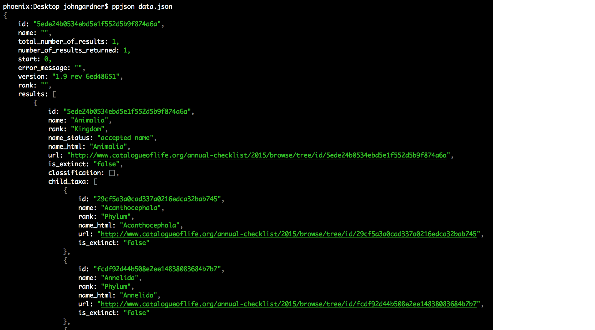

PPJSON
=======

Small command-line utility to pretty-print JSON files. Colour included.




Installation
------------

    npm -g install ppjson

Usage
-----

JSON data can be supplied from a file, or piped through standard input:

    ppjson < json.file
    ppjson json.file
    node spit-json-to-stdout.js | ppjson

Run `man ppjson` to access everything you're reading here.

Options
-------

```
-m, --mutilate           [bool]     Unquote property identifiers in object literals
-u, --underline-urls     [bool]     Decorate URL patterns with underlines
-c, --colour             [bool]     Colourises the prettified output
-i, --indent             [size]     Indentation width, expressed in spaces. Default: 4
-a, --alphabetise                   Order properties alphabetically
```

The `[bool]` options above are all enabled by default.
You can disable them by passing `0`, `"false"`, `"no"` or `"off"` as values (their capitalisation doesn't matter):

    # All these lines are equivalent
    ppjson --mutilate=no
    ppjson --mutilate OFF
    ppjson --mutilate 0
    ppjson  -m0
    ppjson --mutilate false

Option order is inconsequential: it doesn't matter if they're listed before or after a filename:

    # Same damn thing:
    ppjson -m0 file.json
    ppjson file.json -m0


Examples
--------

Use 2 spaces for indentation instead of 4:

    ppjson --indent=2 file.json

Disable colours:

    ppjson -c0 < file.json

Don't remove quote marks from property names:

    ppjson -m false file.json
    ppjson --mutilate nah < file.json

Yes, I really did include `"nah"` as a possible synonym for a false boolean value. Try it.
